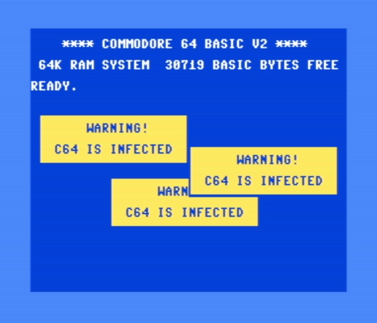

# Commodore 64 reset hook examples

Examples using the `CBM80` cartridge auto-start signature in RAM to intercept a reset switch.

Watch [this video]() to learn more.



## Running the examples

Pre-built `.prg` files can be downloaded from this repository. Simply drag into [VICE](https://vice-emu.sourceforge.io/) to auto-start, or copy to an SD2IEC or similar to run on a real C64.

The `simple` demo is a binary blob that should be loaded at `$8000` (the `,1` is important), then press the RESTORE key or reset switch without typing `RUN`:

```
LOAD "SIMPLE",8,1
```

The `popups` example contains a BASIC launcher and is loaded/run as normal:

```
LOAD "POPUPS",8
RUN
```

Once loaded, the `popups` example can be terminated by entering `POKE32772,0` (to destroy the `CBM80` signature) followed by reset or STOP+RESTORE.

## Building from source

Download [KickAssembler](http://theweb.dk/KickAssembler/Main.html#frontpage) and Java Runtime Environment (JRE)

```
java -jar KickAss.jar simple.asm
java -jar KickAss.jar popups.asm
```

## How the C64 KERNAL handles reset and NMI

The excellent book [Tool Kit: Kernal](https://archive.org/details/COMPUTEs_VIC-20_and_Commodore_64_Tool_Kit_Kernal_1985_COMPUTE_Publications_a) is very helpful when disassembling the C64 KERNAL.

### Reset handler from vector at `$FFFC`

```
.C:fce2  A2 FF       LDX #$FF
.C:fce4  78          SEI
.C:fce5  9A          TXS            ; reset stack pointer
.C:fce6  D8          CLD
.C:fce7  20 02 FD    JSR $FD02      ; check for CBM80 signature
.C:fcea  D0 03       BNE $FCEF
.C:fcec  6C 00 80    JMP ($8000)    ;   if yes, cartridge auto-start
.C:fcef  8E 16 D0    STX $D016      ; reset VIC-II
.C:fcf2  20 A3 FD    JSR $FDA3      ; init CIA, CPU, SID
.C:fcf5  20 50 FD    JSR $FD50      ; memory test - sets MEMSIZ ($283)
.C:fcf8  20 15 FD    JSR $FD15      ; init KERNAL vectors
.C:fcfb  20 5B FF    JSR $FF5B      ; Rev 2+3 only: detect PAL/NTSC, init VIC-II
         20 18 E5    JSR $E518      ; Rev 1 only: init VIC-II
.C:fcfe  58          CLI
.C:fcff  6C 00 A0    JMP ($A000)    ; BASIC cold start
```

*An easy fix for the `CBM80` signature in RAM issue could have been to perform the memory test `JSR $FD50` first, as this detects whether RAM or ROM is found at `$8000`, then only perform the signature check for ROM.*

To hook into the normal reset handler transparently, the auto-start code vectored through `$8000` should duplicate the rest of the code from `$FCEF` onwards, with any added startup code inserted before the jump to BASIC cold start. The MEMSIZ pointer should be changed to `$8000` to prevent BASIC code/variables from overwriting the `CBM80` signature and code placed after.

### NMI handler from vector at `$FFFA`

```
.C:fe43  78          SEI
.C:fe44  6C 18 03    JMP ($0318)    ; user NMI hook (A,X,Y not saved yet!)
.C:fe47  48          PHA            ; <- $318 points here by default
.C:fe48  8A          TXA
.C:fe49  48          PHA
.C:fe4a  98          TYA
.C:fe4b  48          PHA
.C:fe4c  A9 7F       LDA #$7F
.C:fe4e  8D 0D DD    STA $DD0D
.C:fe51  AC 0D DD    LDY $DD0D      ; check if NMI came from CIA
.C:fe54  30 1C       BMI $FE72      ;   if yes, handle CIA interrupts
.C:fe56  20 02 FD    JSR $FD02      ; check for CBM80 signature
.C:fe59  D0 03       BNE $FE5E
.C:fe5b  6C 02 80    JMP ($8002)    ;   if yes, cartridge warm start
.C:fe5e  20 BC F6    JSR $F6BC      ; scan keyboard
.C:fe61  20 E1 FF    JSR $FFE1      ; check if STOP pressed
.C:fe64  D0 0C       BNE $FE72      ;   if not, handle CIA interrupts
.C:fe66  20 15 FD    JSR $FD15      ; init KERNAL vectors
.C:fe69  20 A3 FD    JSR $FDA3      ; init CIA, CPU, SID
.C:fe6c  20 18 E5    JSR $E518      ; init VIC-II
.C:fe6f  6C 02 A0    JMP ($A002)    ; BASIC warm start
.C:fe72  ...
```

Note that the cartridge warm start will be taken when RESTORE key is pressed, regardless of the STOP key. To hook into the normal NMI handler transparently, the code vectored through `$8002` should replicate the handler from `$FE5E` through `$FE71`, with any added startup code inserted before the jump to BASIC warm start. If the STOP key is not pressed, jump back to the NMI handler at `$FE72`.

Also consider that the BRK instruction handler vectored through `$316` points to `$FE66` above. This should be changed to point to the corresponding location in the modified cartridge warm start code.

## More info

<http://tech.guitarsite.de/cbm80.html>
<https://www.c64-wiki.com/wiki/Reset_Button>
<https://ist.uwaterloo.ca/~schepers/MJK/hard_reset.html>